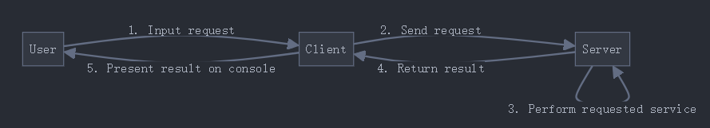

# SC6103_DS: A Distributed Flight Information System
 - CS Architecture
 - UDP sockets


## testInternet: 石头sama!!!!!
## 三台电脑处于同一网络
## server端关闭防火墙  

## Server

### store the information of all flights
```
flight:
{
    flight_id: int
    source_place: variable-length str
    destination_place: variable-length str
    departure_time: {
        year: int
        month: int
        day: int
        hour: int
        minute: int
    }
    airfare: float
    seat_availability: int // num of seats available
    baggage_availability: int
}
```

Marshalling (正常) → byte
byte Message (marshlled) 
socketpackage (massa)
unmarshalling (byte) → 正常


### implement services on the flights for remote access by clients
```
1. query_flight_id (source_place, destination_place) {
    if multiple flights match:
        return a list of all
    if no flight matches:
        return an error message
}

2. query_flight_info (flight_id) {
    if flight_id does not exist:
        return an error message
    else:
        return departure_time, airfare, seat_availability
}

3. make_seat_reservation (flight_id, num_seats) {
    if successful reservation:
        return acknowledgement to client
        update seat_availability on server 
    if flight_id does not exist or insufficient available for num_seats:
        return an error message
}

4. [idempotent] query_baggage_availability (flight_id) {
    if flight_id does not exist:
        return an error message
    else:
        return baggage_availability
}

5. [non-idempotent] add_baggage (flight_id, num_baggages) {
    if successful reservation:
        return acknowledgement to client
        update baggage_availability on server
    if flight_id does not exist or insufficient available for num_baggages:
        return an error message
}

6. callback
    client:
        public interface Callback extends Remote {
            void update_seat_availability (flight_id, seat_availability) throws RemoteException;
        }
    server: 多线程能够处理多个client的同时更新
        public interface Monitor extends Remote {
            void register (Callback cbObject, flight_id, monitor_interval) throws RemoteException {
                record the server_address & port_number;
                if monitor_interval expire then remove the client record;
            }
            void deregister (Callback cbObject) throws RemoteException;
        }


7. create a new thread to serve each request received, and record the client address & port when it receives the request.

8. The received requests and the produced replies should be
printed on the screen.
```

## Client
1. provide an interface that repeatedly asks the user to enter a request and sends the request to the server (client & user - rolling)
 
2. include an option for the user to terminate the client

3. already know the server address and port number

4. Each reply or error message returned from the server should be printed on the screen.

5. GUI


## Message
1. request-reply message structure
    - message_type: int, 1 Byte
        - 0xxx xxxx request
            - 0xxx 0 register
            - 0xxx 1 query_flight_id
            - 0xxx 2 query_flight_info
            - 0xxx 3 make_seat_reservation
            - 0xxx 4 query_baggage_availability
            - 0xxx 5 add_baggage
        - 1xxx xxxx reply 同上顺序
    - request_id: int, 4 Bytes
        - client_id
            - client_addr
            - client_port
        - unique_identifier
    - data_length: int, 4 Bytes
    - data: flight
        - int: 4 Bytes
        - float: 4 Bytes
        - variable-length str
            - str_length: 4 Bytes
            - str_content: 1 Byte for 1 character
2. marshaling & unmarshalling
```
 #include <netinet/in.h>
 uint32_t htonl(uint32_t hostlong);
 uint32_t ntohl(uint32_t netlong);
```
3. fault-tolerance
    - at-least-once
        - server: re-execute
        - client: timeout
    - at-most-once
        - server: store history + filter duplicate + re-reply
        - client: timeout
4. Which semantics to use can be specified as an argument in the command that starts the client/server


# Meeting Notes
## 2024.10.06 19:00
 1. due
    - 2024.10.16 code + report
    - 2024.10.19 demonstration
 2. task decomposition and distribution
    - server side (C) - Gaohan & Ziling
    - client side (Java) - Fanhui & Shuangyue
 3. customized function determination
    - idempotent: choose meal
    - non-idempotent: buy VIP lounge or other additional services

## 2024.10.12 after DS class


## Database
	CREATE DATABASE flight_system;
 
 
	USE flight_system;
 

 	CREATE TABLE flights (
	flight_id INT AUTO_INCREMENT PRIMARY KEY,
	source_place VARCHAR(100) NOT NULL,
	destination_place VARCHAR(100) NOT NULL,
	departure_year INT NOT NULL,
	departure_month INT NOT NULL,
	departure_day INT NOT NULL,
	departure_hour INT NOT NULL,
	departure_minute INT NOT NULL,
	airfare FLOAT NOT NULL,
	seat_availability INT NOT NULL,
	baggage_availability INT NOT NULL
 	);


	INSERT INTO flights (source_place, destination_place, departure_year, departure_month, departure_day, departure_hour, departure_minute, airfare, 	seat_availability, baggage_availability)
	VALUES 
	('Singapore', 'Tokyo', 2024, 10, 12, 8, 0, 500.0, 50, 100),
	('Singapore', 'New York', 2024, 10, 13, 23, 0, 1200.0, 30, 50);


	SELECT * FROM flights;


	gcc -o database_connect F:/ntu/course/6103/SC6103_DS/src/server_c/database_connect.c -IF:/anzhuangbao/Wnmp-4.2.0/mariadb-bins/default/include -	LF:/anzhuangbao/Wnmp-4.2.0/mariadb-bins/default/lib F:/anzhuangbao/Wnmp-4.2.0/mariadb-bins/default/lib/libmariadb.dll


	F:/ntu/course/6103/SC6103_DS/src/server_c/database_connect.exe


### 容错策略选择：

通过 use_at_least_once 标志来控制容错策略。在命令行启动服务器时，可以选择使用 at-least-once 或 at-most-once：

	./server at-least-once
 
	./server at-most-once

服务器根据传入的参数来决定使用哪种容错机制。

### at-least-once 机制：
每次请求都重新执行，不管该请求是否重复。
### at-most-once 机制：
每次请求先检查历史记录，避免重复执行。如果发现该请求已经处理过，则直接返回缓存的响应。

### 多线程支持：
每次接收到请求时，创建新的线程来处理客户端请求。

### 如何使用：
编译并运行服务器：

	gcc server.c callback_handler.c data_storage.c flight_service.c thread_pool.c marshalling.c unmarshalling.c handleRequest.c database_connect.c -o server -lpthread -lws2_32 -IF:/anzhuangbao/Wnmp-4.2.0/mariadb-bins/default/include -LF:/anzhuangbao/Wnmp-4.2.0/mariadb-bins/default/lib F:/anzhuangbao/Wnmp-4.2.0/mariadb-bins/default/lib/libmariadb.dll


运行服务器并选择容错机制：

	./server at-least-once   # 使用 at-least-once 机制
 
	./server at-most-once    # 使用 at-most-once 机制
 
### 总结：
这段代码让服务器可以在启动时根据用户选择的参数来切换不同的容错机制。通过 at-least-once 机制，服务器会每次重新执行请求，而通过 at-most-once 机制，服务器会避免处理重复请求。


**1. 网络接口编程的介绍**

- 接口的定义和目的
- 接口通信的概述（客户端-服务器模型）
- 连程间通信的概念

**2. 接口和端口概述**

- 接口终端的说明
- 将接口绑定到（网络地址，本地端口）的配对
- 连程间通信的详情

**3. C 语言中的接口编程**

- UNIX 系统上的接口编程概述
- 主要系统调用：
    - `socket()`: 创建接口
    - `close()`: 销毁接口
    - `bind()`: 将接口绑定到地址
    - `sendto()` 和 `recvfrom()`: 发送和接收数据
    - `select()`: 检测达到的消息
- 使用 C 语言实现 UDP 通信的示例：
    - 客户端-服务器的消息交换

**4. C 语言中的 TCP 通信**

- TCP 通信的系统调用
- 建立连接（服务器端的 `listen()`，`accept()` 和客户端的 `connect()`）
- 使用 `write()` 和 `read()` 进行数据传输
- TCP 客户端-服务器交互的示例

```

要搭建该服务器，请按照以下步骤操作：

### 1. 项目结构设置
根据给定的项目结构，创建文件夹和文件：
```bash
mkdir -p flight_booking_system/server
cd flight_booking_system/server
touch server.c flight_service.c flight_service.h callback_handler.c callback_handler.h data_storage.c data_storage.h thread_pool.c thread_pool.h Makefile
```

### 2. 编写代码
根据提供的框架细化代码。在每个文件中实现相应的功能：

- **server.c**: 主服务器程序，负责监听客户端请求并进行处理。
- **flight_service.c / flight_service.h**: 实现航班查询、航班详细信息和座位预订等服务。
- **callback_handler.c / callback_handler.h**: 用于处理客户端监控服务中的回调请求。
- **data_storage.c / data_storage.h**: 负责航班数据的管理（存储、添加、更新等操作）。
- **thread_pool.c / thread_pool.h**: 提供一个简单的线程池用于处理并发请求。

#### server.c（主程序框架）
主要实现服务器套接字的创建、绑定，以及请求处理的逻辑。

#### flight_service.c / flight_service.h
这里实现所有与航班服务相关的功能，如航班查询、航班详细信息、座位预订等。将`server.c`中关于航班处理的代码迁移到`flight_service.c`中，并使用头文件来声明这些函数，以便在主程序中调用。

例如：
```c
// flight_service.h
#ifndef FLIGHT_SERVICE_H
#define FLIGHT_SERVICE_H

#include <netinet/in.h>

void handle_query_flight(int sockfd, struct sockaddr_in *client_addr, char *buffer);
void handle_query_details(int sockfd, struct sockaddr_in *client_addr, char *buffer);
void handle_reservation(int sockfd, struct sockaddr_in *client_addr, char *buffer);

#endif
```

### 3. 实现Makefile
创建一个`Makefile`用于管理编译过程，支持编译所有源文件并生成可执行文件：
```makefile
CC = gcc
CFLAGS = -Wall -g
OBJ = server.o flight_service.o callback_handler.o data_storage.o thread_pool.o udp_utils.o

all: server

server: $(OBJ)
	$(CC) $(CFLAGS) -o server $(OBJ)

server.o: server.c
	$(CC) $(CFLAGS) -c server.c

flight_service.o: flight_service.c flight_service.h
	$(CC) $(CFLAGS) -c flight_service.c

callback_handler.o: callback_handler.c callback_handler.h
	$(CC) $(CFLAGS) -c callback_handler.c

data_storage.o: data_storage.c data_storage.h
	$(CC) $(CFLAGS) -c data_storage.c

thread_pool.o: thread_pool.c thread_pool.h
	$(CC) $(CFLAGS) -c thread_pool.c

udp_utils.o: ../common/udp_utils.c ../common/udp_utils.h
	$(CC) $(CFLAGS) -c ../common/udp_utils.c

clean:
	rm -f *.o server
```
该Makefile支持编译每个模块的源文件，并生成服务器的可执行文件`server`。可以通过执行`make`命令来编译代码。

### 4. 编译和运行
首先进入`server`目录并使用`Makefile`进行编译：
```bash
cd flight_booking_system/server
make
```
如果一切正常，你将看到生成的可执行文件`server`。

然后运行服务器：
```bash
./server
```
这将启动UDP服务器并监听端口8080的客户端请求。

### 5. 测试
你可以使用`client_java`项目中的客户端程序来测试服务器是否正常工作。确保在`client_java/resources/config.properties`中设置正确的服务器IP和端口。

### 总结
通过以上步骤，服务器端的项目已经搭建起来，并且实现了各模块之间的分工协作。这种模块化设计有助于开发和维护，例如，你可以独立开发和测试航班服务模块、回调处理模块等。如果遇到任何问题或需要进一步的解释，请告诉我。


