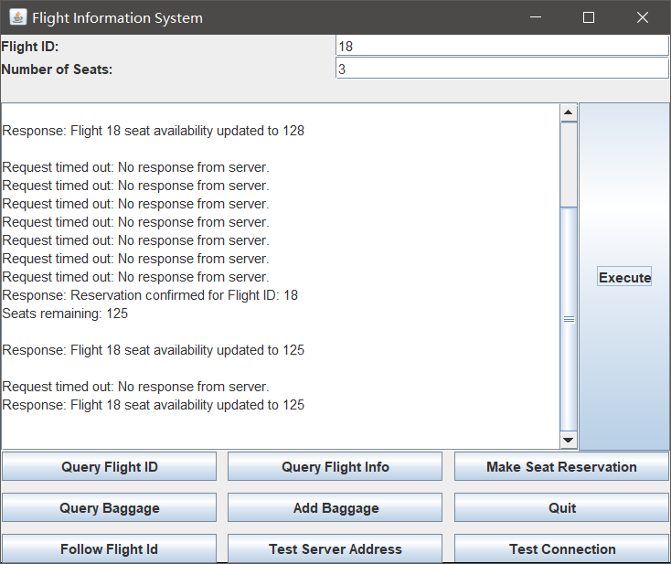

## quiry_flight_id
### Singapore to Shanghai

### London to Beijing

## query_flight_info 
### flight_id=10

### flight_id=26

### make seats reservation

exceed:

185:

add baggage 88
before

add 4 baggages

after

102:
before

add 1 

callback:
server:

45:

client:

 （yfh follow18）

 

